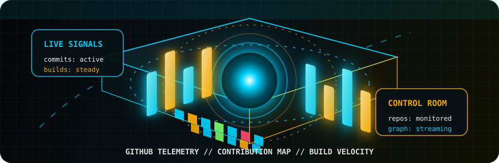
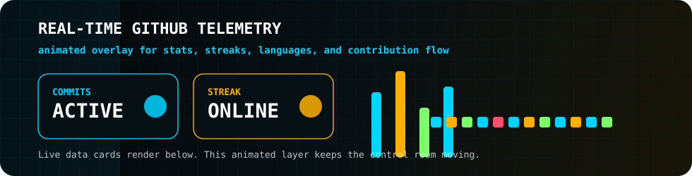

<p align="center">
  
</p>

<p align="center">
  
</p>

<p align="center">
  <a href="https://www.linkedin.com/in/abhiram-rathod/">
    
  </a>
  <a href="https://github.com/Abhiramrathod">
    
  </a>
  <a href="mailto:abhiramrathod2003@gmail.com">
    
  </a>
  <a href="https://abhiramrathod.github.io">
    
  </a>
</p>

<p align="center">
  
  
</p>

<br/>

<p align="center">
  
</p>

---

## SYSTEM PROFILE


```txt
name       : Abhiram Rathod
role       : Software Developer @ Amdocs
location   : Pune, India
education  : B.Tech ECE, NIT Tiruchirappalli
focus      : Distributed systems, real-time streaming, microservices
mindset    : Build clean. Ship reliable. Keep learning.
```

I am a software developer working on production-critical backend systems, with hands-on experience across Java, Spring Boot, Kafka, Couchbase, Kubernetes, CI/CD, and real-time billing workflows.

My engineering lane is straightforward: design services that are readable, scalable, observable, and resilient enough to survive real production pressure.

<br clear="right"/>

---

## CURRENT MISSION

| Signal | Details |
|:--|:--|
| Company | Amdocs |
| Role | Software Developer |
| Product Area | RealTime Billing Product |
| Location | Pune, India |
| Started | June 2024 |
| Work Mode | Full-time |

### Production Workbench

| Track | What I Work With |
|:--|:--|
| Backend Engineering | Java, Spring Boot, Spring Framework, REST APIs |
| Streaming Systems | Apache Kafka, Confluent Kafka, event-driven services |
| Data Layer | Couchbase, Couchbase Capella, distributed data access |
| Platform | Kubernetes, Docker, Jenkins pipelines |
| Quality | TestNG, Jira workflows, release discipline |
| Design | AOP, microservice boundaries, scalable service patterns |

---

## TECH ARSENAL

<p align="center">
  
</p>

### Core Stack

<p align="center">
  
  
  
  
  
</p>

### Streaming And APIs

<p align="center">
  
  
  
  
</p>

### Data And Platform

<p align="center">
  
  
  
  
  
  
  
</p>

---

## EDUCATION

<p align="center">
  
</p>

| Field | Value |
|:--|:--|
| Degree | B.Tech, Electronics and Communications Engineering |
| Institution | National Institute of Technology, Tiruchirappalli |
| Duration | 2020 - 2024 |

---

## CERTIFICATIONS

| Certification | Issuer | Credential |
|:--|:--|:--|
| Couchbase Certified Associate Java Developer | Couchbase | [View](https://www.credly.com/badges/d144eda2-b4d4-4a50-8cd8-1fff0e3bed31) |
| Data Streaming Engineer Foundations | Confluent | [View](https://certificates.confluent.io/038beefa-168f-41e3-ad07-4b0940cb3c4f) |
| Confluent Certified for Apache Kafka | Confluent | [View](https://certificates.confluent.io/ae7ec5a1-7e52-4e77-8c4a-c5e160adfcb3) |
| Java Basic Certification | HackerRank | [View](https://www.hackerrank.com/certificates/5a9b2520ebcf) |

---

## GITHUB CONTROL ROOM

<p align="center">
  
</p>

<p align="center">
  
</p>

<p align="center">
  
</p>

<p align="center">
  
  
</p>

<p align="center">
  
</p>

<p align="center">
  
</p>

---

## OPEN CHANNEL

<p align="center">
  
</p>

<p align="center">
  <a href="mailto:abhiramrathod2003@gmail.com">
    
  </a>
  <a href="https://www.linkedin.com/in/abhiram-rathod/">
    
  </a>
  <a href="https://github.com/Abhiramrathod">
    
  </a>
  <a href="https://abhiramrathod.github.io">
    
  </a>
</p>

<p align="center">
  
</p>
